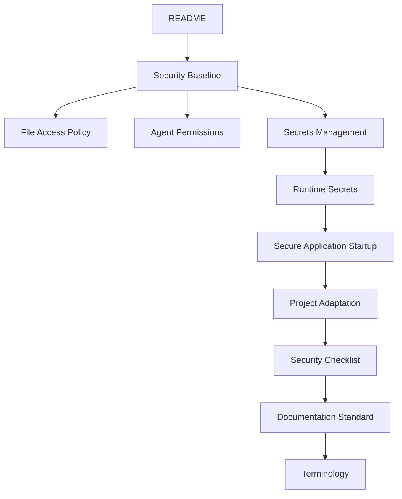
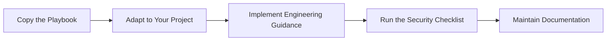

# AI Security Playbook

> **Reusable engineering standards for secure AI-assisted software development.**

A vendor-neutral documentation framework that helps engineering teams introduce AI coding assistants
without relying on scattered conventions, undocumented practices, or tool-specific guidance.

---

## Why I Built This

AI coding assistants are changing software engineering faster than engineering standards are
evolving.

Across different projects I repeatedly encountered the same problem: security guidance existed, but
it was scattered across onboarding documents, internal conventions, vendor documentation, and
individual experience. Reusing it from one project to another required rebuilding the same
engineering practices every time.

This repository is my attempt to solve that problem by treating documentation as an engineering
system rather than a collection of documents.

Instead of mixing security policy, implementation guidance, operational checklists, and
project-specific notes, the repository separates them into independent documentation layers with
explicit responsibilities.

The goal is not to prescribe how software should be built, but to provide a reusable engineering
foundation that teams can adapt to their own projects.

---

# What Makes This Repository Different

Unlike traditional security documentation, this repository is designed as an engineering
architecture.

- Security policy is separated from implementation.
- Engineering guidance is separated from operational verification.
- Every document owns exactly one responsibility.
- Cross-references replace duplicated guidance.
- Documentation is reusable across projects.
- The framework remains vendor-neutral and technology-neutral.
- Documentation itself is treated as part of software architecture.

---

# What's Inside

### Policy

Defines security expectations and architectural boundaries.

- [Security Baseline](docs/policy/SECURITY_BASELINE.md)
- [File Access Policy](docs/policy/FILE_ACCESS_POLICY.md)
- [Agent Permissions](docs/policy/AGENT_PERMISSIONS.md)
- [Secrets Management](docs/policy/SECRETS_MANAGEMENT.md)

### Engineering Guidance

Explains how those policies are applied during software development.

- [Runtime Secrets](docs/guidance/RUNTIME_SECRETS.md)
- [Secure Application Startup](docs/guidance/SECURE_APPLICATION_STARTUP.md)
- [Project Adaptation](docs/guidance/PROJECT_ADAPTATION.md)

### Operations

Provides lightweight operational verification.

- [Security Checklist](docs/operations/CHECKLIST.md)

### Reference

Keeps the knowledge base consistent and maintainable.

- [Documentation Standard](docs/reference/DOCUMENTATION_STANDARD.md)
- [Terminology](docs/reference/TERMINOLOGY.md)

---

# Documentation Architecture

```text
Policy
        │
        ▼
Engineering Guidance
        │
        ▼
Operations
        │
        ▼
Reference
```



---

# Repository Organization

```text
ai-security-playbook/

docs/
    policy/
    guidance/
    operations/
    reference/

examples/

templates/

assets/
```

---

# Typical Workflow



---

# Quick Start

1. Read [Security Baseline](docs/policy/SECURITY_BASELINE.md) to understand the engineering model.
2. Adapt the playbook using [Project Adaptation](docs/guidance/PROJECT_ADAPTATION.md).
3. Configure project-specific examples and templates.
4. Verify implementation using the [Security Checklist](docs/operations/CHECKLIST.md).
5. Maintain the documentation as the project evolves.

---

# Typical Use Cases

This repository is intended for engineering teams that want consistent standards for AI-assisted
software development.

Typical scenarios include:

- Starting a new software project
- Introducing AI coding assistants into an existing codebase
- Building reusable engineering standards
- Standardizing development across multiple repositories
- Reviewing AI-assisted engineering workflows
- Creating project templates for internal teams

---

# Design Principles

Every document in this repository follows the same architectural principles.

- Single Responsibility
- Policy before Implementation
- Engineering Guidance before Tooling
- Documentation as Architecture
- Explicit Ownership
- Minimal Duplication
- Vendor Neutrality
- Reuse before Reinvention

---

# What This Repository Is Not

This repository intentionally avoids solving unrelated problems.

It is **not**:

- an enterprise security framework;
- a compliance framework;
- cloud infrastructure documentation;
- infrastructure hardening guidance;
- vendor documentation;
- AI model security guidance;
- an AI governance framework.

Its scope is intentionally limited to **secure AI-assisted software development**.

---

# Repository Status

**Version:** 1.0

This repository represents a stable engineering baseline.

Future versions evolve conservatively based on practical engineering experience rather than
theoretical completeness.

The long-term goal is to validate and refine the playbook through real software projects instead of
continuously expanding documentation.

---

# Contributing

Contributions should preserve the architecture of the knowledge base.

Before proposing changes, review:

- [Documentation Standard](docs/reference/DOCUMENTATION_STANDARD.md)
- [Terminology](docs/reference/TERMINOLOGY.md)

Every new document should:

- own exactly one responsibility;
- avoid duplicating existing guidance;
- follow the documentation standard;
- preserve the separation between Policy, Engineering Guidance, Operations, and Reference.

---

# License

Licensed under the MIT License. See LICENSE for details.
